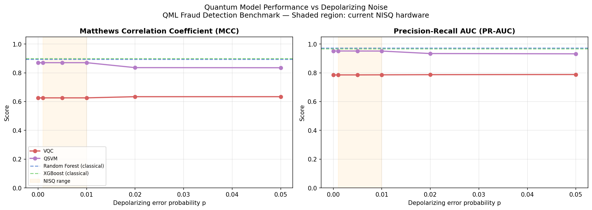
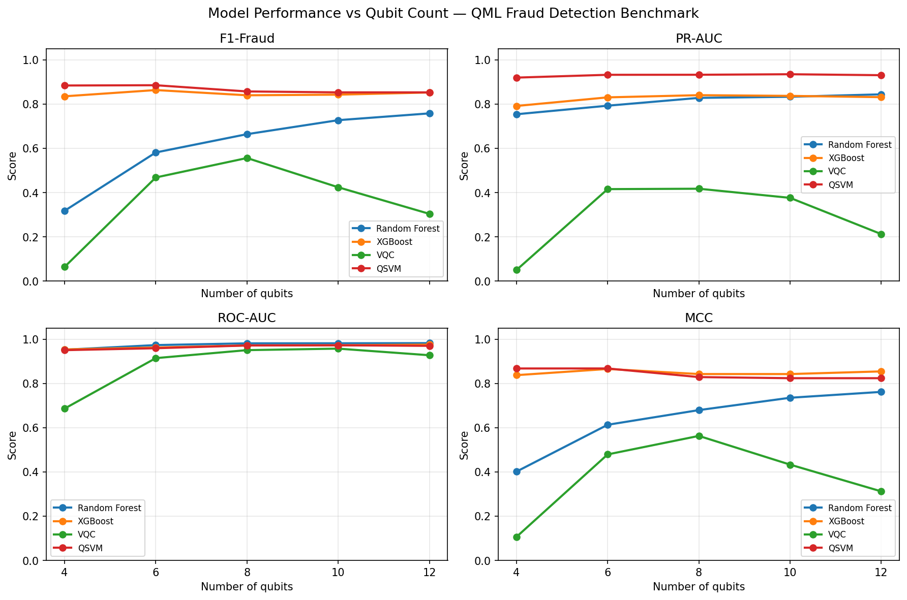

# QML Fraud Detection Benchmark

> **Client:** Leading Financial Service Provider
> **Objective:** Evaluate the practical utility of Hybrid Quantum-Classical Machine Learning for real-time financial fraud detection in the NISQ era.

---

## Key Findings

**Quantum advantage was not demonstrated in this setting.**

| Model | F1-Fraud | MCC | ROC-AUC | PR-AUC |
|---|---|---|---|---|
| XGBoost | **0.924** | **0.900** | 0.974 | 0.968 |
| Random Forest | 0.917 | 0.894 | **0.983** | **0.974** |
| QSVM (p=0.0) | 0.905 | 0.871 | 0.963 | 0.952 |
| VQC (p=0.0) | 0.699 | 0.626 | 0.875 | 0.785 |

- **QSVM** is competitive — within ~1.3% F1 of Random Forest at zero noise — but does not exceed classical baselines.
- **VQC** underperforms significantly (~22% below XGBoost). The bottleneck is model capacity (8 qubits / 30 epochs), not noise.
- Both quantum models remain below classical at all depolarizing noise levels tested (p = 0.0 → 0.05).

See the [noise sweep results notebook](notebooks/02_noise_sweep_results.ipynb) for the full analysis.

---

## Overview

This repository implements a rigorous benchmarking framework comparing quantum and classical models on credit card fraud detection:

| Model | Type | Library |
|---|---|---|
| Random Forest | Classical | scikit-learn |
| XGBoost | Classical | xgboost |
| Variational Quantum Classifier (VQC) | Quantum | PennyLane |
| Quantum Support Vector Machine (QSVM) | Quantum | PennyLane + scikit-learn |

The benchmark is designed around the specific challenges of financial fraud detection:
- **Extreme class imbalance** (~0.17% fraud in the reference dataset)
- **High dimensionality** vs. the limited qubit count of NISQ simulators
- **Rigorous metrics** — F1-Fraud, MCC, PR-AUC, ROC-AUC (accuracy is reported as reference only)

---

## Project Structure

```
qml-fraud-detection-benchmark/
├── data/
│   ├── raw/                        # Place creditcard.csv here
│   └── processed/                  # Auto-generated preprocessed arrays
├── notebooks/
│   └── 02_noise_sweep_results.ipynb  # Noise sweep analysis and conclusions
├── results/
│   ├── figures/                    # Benchmark and ablation plots
│   └── noise/
│       └── noise_vs_metric.png     # Noise sweep: F1-Fraud and MCC vs p
├── src/
│   ├── data_loader.py              # Dataset verification
│   ├── preprocessing.py            # Scaling · SMOTE · PCA pipeline
│   ├── classical_models.py         # Random Forest & XGBoost
│   ├── quantum_models.py           # VQC & QSVM (PennyLane)
│   └── evaluation.py              # Metrics, plots, comparison tables
├── tests/
├── run_benchmark.py                # Main benchmark entrypoint
├── run_ablation.py                 # Qubit count sweep (4–12 qubits)
├── run_noise.py                    # Depolarizing noise sweep
├── run_noise_parallel.sh           # Parallel noise sweep launcher
├── run_noise_watcher.sh            # Queue-based watcher for long runs
└── run_plots.py                    # Plot generation from saved results
```

---

## Dataset

The benchmark uses the [Kaggle Credit Card Fraud Detection](https://www.kaggle.com/datasets/mlg-ulb/creditcardfraud) dataset.

```bash
# Option A – Kaggle CLI
kaggle datasets download -d mlg-ulb/creditcardfraud --path data/raw --unzip

# Option B – Manual
# Download creditcard.csv from Kaggle and place at data/raw/creditcard.csv
```

---

## Setup

```bash
python -m venv .venv
source .venv/bin/activate      # Windows: .venv\Scripts\activate
pip install -r requirements.txt
pip install -e . --no-deps
```

---

## Running the Benchmark

```bash
# Classical baselines only (fast)
python run_benchmark.py --n-qubits 8 --classical-only --cv-folds 0 --no-plots

# Full benchmark (classical + VQC + QSVM)
python run_benchmark.py --n-qubits 8

# Qubit ablation study
python run_ablation.py

# Depolarizing noise sweep (long — ~3 days on M4 Mac Mini)
bash run_noise_parallel.sh
```

---

## Preprocessing Pipeline

| Challenge | Solution |
|---|---|
| Class imbalance (~0.17% fraud) | SMOTE oversampling (training set only) |
| Outliers in transaction amounts | `RobustScaler` (median/IQR-based) |
| High dimensionality (30 features) | PCA to n_qubits components |
| Data leakage prevention | PCA & scaler fitted on train split only |

---

## Quantum Models

### Variational Quantum Classifier (VQC)

```
AngleEmbedding(X) → StronglyEntanglingLayers(weights) → ⟨Z₀⟩
```

- 8 qubits, 2 layers, 30 training epochs, Adam optimiser
- Backend: `lightning.qubit` (ideal), `default.mixed` (noisy simulation)

### Quantum SVM (QSVM)

- Quantum kernel: K(x, x') = |⟨φ(x)|φ(x')⟩|²
- Feature map: double `AngleEmbedding` (captures 2nd-order feature interactions)
- Kernel matrix fed to scikit-learn `SVC(kernel="precomputed")`

---

## Noise Sweep

Depolarizing noise was swept across `p = [0.0, 0.001, 0.005, 0.01, 0.02, 0.05]`.



| Model | p=0.0 | p=0.001 | p=0.01 | p=0.05 |
|---|---|---|---|---|
| QSVM | 0.905 | 0.905 | 0.905 | 0.881 |
| VQC  | 0.699 | 0.699 | 0.699 | 0.707 |

**QSVM** degrades gracefully — only ~2.7% F1 drop from p=0.0 to p=0.05. **VQC** shows no meaningful noise degradation because it is already at its performance floor.

At current best NISQ hardware noise (p ≈ 0.001), QSVM achieves F1-fraud = 0.905, remaining ~2% below Random Forest.

---

## Qubit Ablation Study

An ablation study systematically varies one component to measure its effect — here, qubit count — while keeping everything else fixed. We swept `n_qubits ∈ [4, 6, 8, 10, 12]` for both VQC and QSVM.



**QSVM** is essentially flat across the entire sweep (F1-fraud ~0.85–0.91). More qubits yield no meaningful gain, and performance dips slightly at 10–12 qubits. Two reasons:

- **Concentration of measure.** As the quantum circuit grows, kernel values K(x, x') converge toward the same number — data points become indistinguishable in Hilbert space, degrading the kernel's ability to separate fraud from non-fraud. This is a known fundamental limitation of large quantum kernels.
- **Diminishing PCA signal.** Each extra qubit adds one more PCA component, but later components capture less and less variance. At 12 qubits the model is partially trained on noise.

**VQC** peaks at 8 qubits then drops sharply at 10–12. The same PCA effect applies, compounded by **barren plateaus** — with deeper circuits the gradient landscape flattens, making training increasingly ineffective.

**Takeaway:** 8 qubits is the sweet spot for this dataset. More qubits add compute cost with no benefit, and can actively hurt performance.

---

## Running Tests

```bash
pytest tests/ -v
```

---

## Learnings

1. **QSVM is surprisingly noise-tolerant.** Its kernel structure buffers it from depolarizing noise far better than the circuit-based VQC. If a quantum model were to be deployed on NISQ hardware, QSVM is the stronger candidate.

2. **VQC's problem is not noise — it's capacity.** With 8 qubits and 30 epochs, VQC is underpowered for a 30-feature, heavily imbalanced fraud dataset. Noise makes virtually no difference because the model is already at its floor.

3. **Classical models are not easily displaced.** XGBoost and Random Forest are well-matched to tabular fraud data: they handle imbalance, feature interactions, and high dimensionality natively. Quantum models need a structural advantage in the data to compete — which does not exist here.

4. **SMOTE miscalibrates quantum model thresholds.** Oversampling shifts the decision boundary such that default thresholds (0.5) produce poor precision/recall trade-offs. Post-training threshold tuning on the validation set is essential.

5. **Parallel execution is necessary for noise sweeps.** Each noise level takes 26–37h on an M4 Mac Mini. Running all 6 levels in parallel reduces wall time from ~9 days to ~3.5 days.
